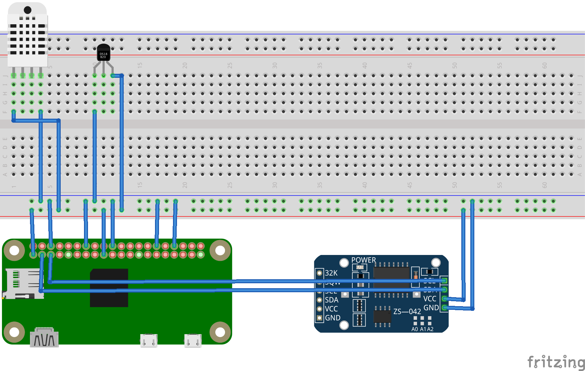

HAPImodule
==========

Release 1 of the HAPI system uses Raspberry Pi Zeros (HAPiZ) as the **Smart Modules** that run the system code, the sensor code and the control code. Multiple HAPiZ devices can exist within the system and collaborate to determine the tasks performed by each module.

Hardware Setup
--------------
A minimum HAPiZ module consists of the following components:

* Raspberry Pi Zero
* Real-time-clock (DS3231)
* Temperature and humidity sensor (DHT22)

  .. image:: img/DHT22.jpg

* Water temperature sensor (DS18B20)

  .. image:: img/DS18B20.jpg

Prototype Diagram
~~~~~~~~~~~~~~~~~

Software Setup
--------------
Note: Soon we'll introduce configuration via regular file and/or database. For now all configuration are hardcoded.

1. Install `Raspbian <https://www.raspberrypi.org/downloads/raspbian/>`_ on the Raspberry Pi

  * `Raspbian installation guide <https://www.raspberrypi.org/documentation/installation/installing-images/README.md>`_.
  
  * **Configure Raspbian Jessie**
  
      * At minimum, using ssh or graphical shell:
      
        .. code:: shell
        
            sudo raspi-config      
      
      * Set password
      * Set hostname (e.g.HAPImodule001)
      * Set locale
      * Set keyboard
      * Set timezone
      * Set wifi - country, ssid, and password
      
      * Reboot

2. Install dependencies on the Pi

  * Dependencies:

    * **Avahi** (daemon) configured to publish MQTT service. avahi is already installed on Raspi Jessie.

      * :download:`Example config <example_configs/avahi-example>`
      * Copy the file to the config directory and rename it:
      
        .. code:: shell
        
            sudo cp ~/Downloads/avahi-example /etc/avahi/services/multiple.service
            
      * Restart to apply changes:

        .. code:: shell

            systemctl restart avahi-daemon.service

    * **MQTT Mosquitto** with default configuration.

      * Install mosquitto
       
        .. code:: shell
        
            sudo apt-get install mosquitto     

      * :download:`Example config <example_configs/mosquitto-example>`
      * Copy the file to the config directory and rename it:
      
        .. code:: shell
        
            sudo cp ~/Downloads/mosquitto-example /etc/mosquitto/conf.d/mosquitto.conf
            
      * Start mosquitto to apply config, and set mosquitto to start on boot:

        .. code:: shell

            sudo systemctl start mosquitto
            sudo systemctl enable mosquitto

    * **Influxdb** with default configuration.
        `https://easysquirrel.io/index.php/2017/03/20/influxdb-and-telegraf-on-raspberry-pi-3/`
        `http://docs.influxdata.com/influxdb/v1.2/introduction/installation`
        
        * the configuration file is located at /etc/influxdb/influxdb.conf for default installations  
        * test by typing 'influx' at the command line  

      * **add influxdb repository**

        .. code:: shell

          curl -sL https://repos.influxdata.com/influxdb.key | sudo apt-key add -
          source /etc/os-release
          test $VERSION_ID = "7" && echo "deb https://repos.influxdata.com/debian wheezy stable" | sudo tee /etc/apt/sources.list.d/influxdb.list
          test $VERSION_ID = "8" && echo "deb https://repos.influxdata.com/debian jessie stable" | sudo tee /etc/apt/sources.list.d/influxdb.list

      * Install libfontconfig1 (required)

        .. code:: shell

          sudo apt-get install libfontconfig1
          sudo apt-get -f install
            
      * **influxdb**

        .. code:: shell

          sudo apt-get update && sudo apt-get install influxdb
          sudo service influxdb start 

      * **Telegraf**

        .. code:: shell

          sudo apt-get update && sudo apt-get install telegraf
          sudo service telegraf start

    * **Grafana** [Optional] (highly recommended)
    
        .. code:: shell
        
          cd ~
          wget --output-document=grafana_4.2.0-beta1_armhf.deb https://bintray.com/fg2it/deb/download_file?file_path=testing%2Fg%2Fgrafana_4.2.0-beta1_armhf.deb
          sudo dpkg -i grafana_4.2.0-beta1_armhf.deb
          sudo apt-get install -f

    * Enable Grafana for automatic start on boot and start the server
    
        .. code:: shell
        
          sudo systemctl enable grafana-server
          sudo systemctl start grafana-server

    * Reboot your Raspberry Pi

        .. code:: shell
        
          sudo reboot    
 
3. Install hapi

  * **Install hapi dependencies on the Pi** 
    * There is also a script from the repo for installing the first two system dependencies and then setup the python environment:

      .. code:: shell

          sudo apt-get install git
          cd ~
          git clone https://github.com/mayaculpa/hapi.git
          cd ~/hapi/src/smart_module
          ./INSTALL.sh

    * It is good practice to look over scripts you download from the Internet before running them.

Usage
-----
**Start the program:**

.. code:: shell

    python smart_module.py

**You should get output like this:**

.. code:: shell

    (venv) $ python smart_module.py
    2017-07-02 12:15:58.202878 - smartmodule.log - [*] INFO - Communicator initialized
    Mock Smart Module hosting asset HSM-WT123-MOCK wt Environment.
    2017-07-02 12:15:58.211355 - smartmodule.log - [*] INFO - Performing Broker discovery...
    2017-07-02 12:16:01.213817 - smartmodule.log - [*] INFO - MQTT Broker: ArchMain.local. IP: 192.168.0.99.
    2017-07-02 12:16:04.217127 - smartmodule.log - [*] INFO - Connecting to ArchMain.local. at 192.168.0.99.
    2017-07-02 12:16:04.218420 - smartmodule.log - [*] INFO - Closing Zeroconf connection.
    2017-07-02 12:16:04.239513 - smartmodule.log - [*] INFO - Connected with result code 0
    $SYS/broker/clients/total 0
    2017-07-02 12:16:08.720840 - smartmodule.log - [*] INFO - No Scheduler found. Becoming the Scheduler.
    2017-07-02 12:16:08.721437 - smartmodule.log - [*] INFO - Loading Schedule Data...
    2017-07-02 12:16:08.748795 - smartmodule.log - [*] INFO - Schedule Data Loaded.
    2017-07-02 12:16:08.749374 - smartmodule.log - [*] INFO -   Loading seconds job: System Status.
    2017-07-02 12:16:08.749580 - smartmodule.log - [*] INFO -   Loading seconds job: Check Alert.
    2017-07-02 12:16:08.750986 - smartmodule.log - [*] INFO - Scheduler program loaded.
    2017-07-02 12:16:08.753495 - smartmodule.log - [*] INFO - Influxdb information loaded.
    2017-07-02 12:16:08.755970 - smartmodule.log - [*] INFO - Site data loaded.
    $SYS/broker/clients/total 1
    Running command self.smart_module.on_check_alert()
    ASSET/QUERY Is it warm here?
    ASSET/RESPONSE/HSM-WT123-MOCK {"value_current": "31.0", "name": "Temperature Sensor", "context": "Environment", "virtual": 1, "type": "wt", "enabled": 1, "id": "HSM-WT123-MOCK", "unit": "C", "system": ""}
    2017-07-02 12:16:19.070110 - smartmodule.log - [*] INFO - Wrote to analytic database.
    2017-07-02 12:16:19.070215 - smartmodule.log - [*] INFO - Fetching alert parameters from database.
    2017-07-02 12:16:19.070936 - smartmodule.log - [*] INFO - Closing Alert database connection.
    2017-07-02 12:16:19.071006 - smartmodule.log - [*] INFO - [!] ALERT DETECTED. Value: 31.0.
    ALERT/HSM-WT123-MOCK {"upper": 30.0, "lower": 10.0, "value_current": "31.0", "response": "email,sms", "message": "Houston, we have a problem", "notify_enabled": 1, "id": "HSM-WT123-MOCK"}
    2017-07-02 12:16:19.071630 - smartmodule.log - [*] INFO - Sending email notification.
    2017-07-02 12:16:19.072025 - smartmodule.log - [*] INFO - Mail settings loaded.
    2017-07-02 12:16:22.287407 - smartmodule.log - [*] INFO - Email notification sent.
    2017-07-02 12:16:22.485832 - smartmodule.log - [*] INFO - Sending SMS notification.
    [...]

An important note: we're currently using sqlite3 database to load schedule jobs and others information.
You can check/use a demo of the database here: :download:`database-example <example_configs/database-example>`
For now you should place it on the same folder as `smart_module.py` and name it as `hapi_core.db`.
